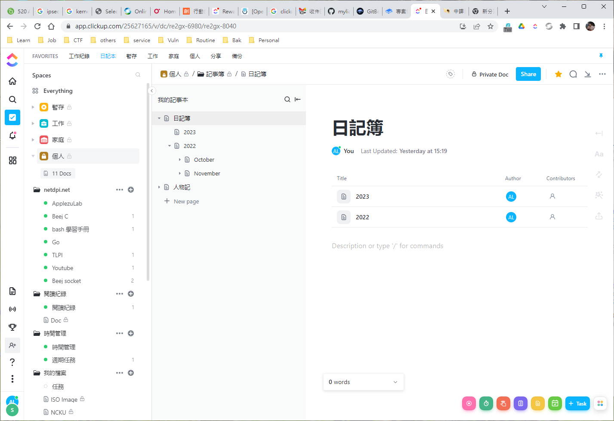

# TCP 與 SCTP 協定轉換機制

Aaron Liao

由於SCTP通訊協定是新興傳輸協定，目前多數之網路設備與網路程式設計皆以TCP通訊協定傳輸可靠資料，因此，在SCTP通訊協定尚未普及之前，TCP與SCTP通訊協定會有一段期間是長期共存的，為了讓使用TCP通訊協定之系統能夠與SCTP通訊協定之系統相互通訊，因此，陸續有學者提出代理之方法，同時，為了將SCTP通訊協定之優點直接應用於現有之TCP網路環境中，以下將分別進行探討相關方法。

1\. SCTPGATE

Huang \[1] 提出SCTPGATE之SCTP Proxy方法，SCTPGATE可達到代理TCP與SCTP通訊協定資料交換之目的，作者將SCTP通訊協定加入SOCKS v4 \[2] 應用程式中，使SOCKS應用程式可同時支援TCP與SCTP通訊協定，因此能夠處理TCP與SCTP通訊協定間的傳輸資料，可負責代理轉送的工作。SOCKS協定於OSI 模型中位於傳輸層與應用層間，不僅能作為proxy伺服器，亦能夠設定條件作為防火牆過濾之功能。作者所提出之SCTPGATE運作模式如圖1所示，SCTP client之網路應用程式所傳輸的資料在經過SCTPGATE時，SOCKS會接收SCTP client傳送的資料，並以TCP協定進行代理轉送資料予remote TCP server，以此代理方式達成TCP與SCTP通訊協定之互通。

<figure><figcaption>
圖1、SCTPGATE網路堆疊圖
</figcaption></figure>

<figure><figcaption>
圖2、SCTPGATE系統流程圖
</figcaption></figure>

SCTPGATE整體的運作方法如圖2所示，客戶端（client）在與遠端主機連線之前，需先行發送連線請求給SCTPGATE，在請求中會告知SCTPGATE遠端主機之IP位址與連接埠號（port number），而SCTPGATE在接收到此請求之後，會根據請求中所指定的IP與連接埠進行連線的建立，當完成連線建立時，SCTPGATE再回報客戶端端通知連線已經建立成功，而SCTPGATE則開始負責兩端點資料的轉送工作。SCTPGATE之方法為接收以TCP（SCTP）通訊協定傳輸之資料，再將資料轉以SCTP（TCP）通訊協定傳送，轉換方式運作為於傳輸層之上將資料接收並重新封裝後進行傳輸，而非將傳輸層之TCP通訊協定與SCTP通訊協定互相轉換。

2\. TCP/SCTP translator

Chang等學者 \[3] 在2005年提出了TCP/SCTP通訊協定轉換機制的proxy網路架構與概念，於TCP與SCTP協定間進行轉換，讓TCP端點設備可透過SCTP proxy轉換伺服器而能夠與使用SCTP之端點通訊。在圖3表示TCP/SCTP translator之轉換能夠在傳輸層對於TCP與SCTP通訊協定直接進行轉換，因此可以讓單獨運作TCP與SCTP通訊協定之端點設備可透過TCP/SCTP translator之代理轉換而互相通訊。

<figure><figcaption>
圖3、TCP/SCTP translator網路堆疊圖（一）
</figcaption></figure>

TCP轉換至SCTP通訊協定過渡期間所面臨的情況，即當兩端點皆為TCP通訊協定時，如圖4所示，需要分別架設一部TCP/SCTP translator用以將一方端點網路所傳輸之TCP訊息轉換為SCTP訊息後傳輸至另一方，並再將接收之SCTP訊息轉換還原為TCP訊息，再傳送給TCP端點。

<figure><figcaption>
圖4、TCP/SCTP translator網路堆疊圖（二）
</figcaption></figure>

圖5為TCP/SCTP轉換之示意圖，TCP node (A) 傳送之TCP訊息在經過TCP/SCTP translator (C)時，整個TCP訊息會被拆解並且對應為SCTP訊息，再以SCTP通訊協定將資料傳輸至TCP/SCTP translator (D)，而當TCP/SCTP translator (D) 接收到SCTP訊息時，會將SCTP訊息拆解恢復為對應之TCP訊息後，再轉送給TCP node (B)。這樣的轉換方式不需更動兩端點之網路設備與設定就能夠達到以SCTP通訊協定代替TCP通訊協定傳輸資料之目的。

<figure><figcaption>
圖5、TCP/SCTP轉換示意圖
</figcaption></figure>

在TCP/SCTP訊息轉換的處理方面，圖6為初始連線的轉換流程，當TCP node (A) 與TCP node (B) 建立TCP連線時，需要進行三向交握的連線過程，由圖6可知，當TCP node (A) 送出的TCP之SYN訊息在經過TCP/SCTP translator (C) 時，TCP的SYN訊息會轉換為SCTP之INIT訊息，並且在傳送到TCP/SCTP translator (D) 時，再將SCTP INIT訊息轉換為原本TCP SYN訊息並傳送至TCP node (B)，將TCP通訊協定初始連線所使用的封包與SCTP通訊協定初始連線之封包互相對應轉換，而完成連線建立之目的。

<figure><figcaption>
圖6、初始連線流程圖
</figcaption></figure>

在結束連線的過程，如圖7所示，TCP通訊協定以四向交握方式終止連線，需要由節點雙方提出結束連線之請求才會完全中斷連線，而SCTP通訊協定僅以三向交握終止連線，僅需要一方提出終止連線就會中斷連線，並沒有TCP通訊協定之半關閉（half-closed）狀態。

<figure><figcaption>
圖7、終止連線流程圖
</figcaption></figure>

TCP/SCTP translator之設計概念是將TCP通訊協定之封包格式與功能與SCTP通訊協定相互對應，因而，當translator收到TCP通訊協定之封包時，能夠轉換為SCTP通訊協定之封包訊息。同理，在接收到SCTP訊息時也能夠轉換為TCP通訊協定之封包。TCP/SCTP translator之概念亦具有通透性（transparent）之優點，原本之網路環境可不需要進行任何變更則能夠使用，轉換的方式是於傳輸層直接進行TCP與SCTP通訊協定之轉換。

本文探討了目前的SCTP proxy之設計與實作，SCTPGATE之實作結合了SOCK v4協定，SOCK協定屬於傳輸層與應用層之間。而TCP/SCTP translator之概念為傳輸層TCP通訊協定與SCTP通訊協定之間的直接轉換，然而，實作TCP/SCTP translator需要更深入設計TCP與SCTP通訊協定之間的轉換，需要完整的處理協定間功能的對應。

參考文獻

\[1] T.C. Huang, Design and Implementation of TCP-Compatible SCTP Vertical Handoff Platform for All-IP Heterogeneous Networks, Master Thesis, Department of Computer Science, National Tsing-Hua University, HsingChu, Taiwan, 2005.

\[2] Y. D. Lee, SOCKS: A Protocol for TCP proxy across firewalls, http://archive.socks.permeo.com/protocol/socks4.protocol.

\[3] L.H. Chang, J.J. Lo, H.J. Lin, C.L. Lo, and C.F. Tai, “The Design and Analysis of SCTP Proxy”, The 11th Mobile Computing Workshop, Chang Gung University, Taoyuan, Taiwan, March 31, 2005.
